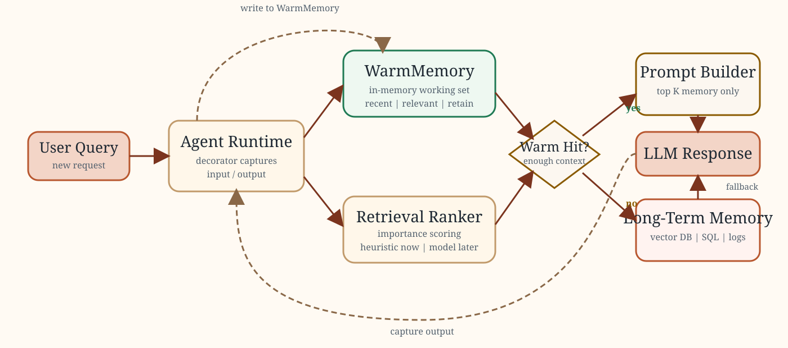

# WarmMemory

WarmMemory is a research prototype for short-term memory management in LLM agents.
It adds a small in-process working-memory layer that keeps the most recent or most
relevant interactions close to the agent, reducing repeated retrieval work and helping
control prompt growth.

This repository is designed as a portfolio-quality research artifact:

- a reusable Python package for warm-memory buffering,
- a decorator for automatic interaction capture,
- a pluggable importance scoring interface,
- a deterministic benchmark for recency vs relevance vs fallback memory policies,
- and HTML documentation for architecture and usage.

## Project Status

This project is currently a `research prototype`.

It should be described as:

- an agent-memory architecture experiment,
- a benchmarking framework for working-memory policies,
- and a base for future model-based memory research.

It should not be described as a new foundational memory algorithm unless future work
adds a genuinely novel retention or ranking method with strong empirical evidence.

## Why This Exists

Many agent systems use one of two expensive patterns:

- they keep appending conversation history to the prompt,
- or they query long-term memory on nearly every turn.

Both increase latency and cost. WarmMemory introduces a hot path:

- keep a small working set in RAM,
- retrieve from that working set first,
- fall back to longer-term retrieval only when needed,
- and send only a compact context window to the model.

## Core Ideas

### 1. Sliding-Window Memory

The system can keep the last `N` interactions using `recent(k)`.

### 2. Relevance-Aware Memory

Instead of only keeping the latest messages, the system can rank rows against the
current query using `relevant(query, k)` and compact the active working set with
`retain_relevant(query, k)`.

### 3. Automatic Agent Capture

The `@remember_interaction` decorator records agent inputs and outputs without forcing
changes into the core agent logic.

### 4. Two-Tier Memory Architecture

The benchmark models a practical split:

- warm memory for fast in-process access,
- long-term memory for slower fallback retrieval.

## Repository Layout

- `warm_memory/`: package source code
- `warm_memory/buffer.py`: Pandas-backed warm-memory store
- `warm_memory/scoring.py`: scoring interface and default heuristic scorer
- `warm_memory/decorators.py`: function decorator for interaction capture
- `warm_memory/benchmark.py`: deterministic benchmark harness
- `warm_memory/workload.py`: synthetic workload for evaluation
- `scripts/run_benchmark.py`: benchmark entrypoint
- `reports/warm_memory_benchmark.md`: generated benchmark output
- `docs/warm_memory_guide.html`: public-facing HTML documentation
- `tests/`: unit tests

## Installation

```bash
python3 -m pip install -e .
```

## Quick Start

```python
from warm_memory import WarmMemoryBuffer, remember_interaction

memory = WarmMemoryBuffer(capacity=8)

@remember_interaction(memory)
def agent(prompt: str) -> str:
    if "billing" in prompt.lower():
        return "Your invoice is available in the billing portal."
    return f"Echo: {prompt}"

agent("How do I reset my password?")
agent("Where is my billing invoice?")

recent_rows = memory.recent(4)
relevant_rows = memory.relevant("invoice", limit=2)
memory.retain_relevant("invoice", limit=4)
```

## Example Usage Pattern

Use WarmMemory in front of a larger memory system:

1. Receive a new user query.
2. Search the warm buffer first.
3. If warm memory is sufficient, build a compact prompt from those rows.
4. If warm memory is weak, fall back to long-term retrieval.
5. Write the new interaction back into warm memory.

This pattern is useful for:

- coding agents,
- research assistants,
- task-oriented copilots,
- customer support agents,
- and any multi-turn system with repeated local context.

## Benchmark

The repository includes a deterministic benchmark that compares:

- `recency`: always use the latest warm-memory rows,
- `relevance`: rank and retain the top relevant warm-memory rows,
- `fallback`: use warm relevance first, then long-term retrieval on misses.

Run it with:

```bash
python3 scripts/run_benchmark.py
```

This writes a report to `reports/warm_memory_benchmark.md`.

On the current synthetic workload, the tradeoff looks like this:

- `recency` is the fastest policy,
- `fallback` is the most accurate policy,
- `relevance` sits between the two and provides a cleaner hot working set.

That is the intended research outcome: not one universal winner, but a measurable
latency-accuracy tradeoff.

## Documentation

- HTML guide: `docs/warm_memory_guide.html`
- Benchmark report: `reports/warm_memory_benchmark.md`
- README visual: `docs/warm_memory_architecture.svg`

The HTML guide explains:

- how the architecture works,
- where latency is saved,
- how to use the package,
- and how to describe the contribution honestly.

## Architecture Preview



For a richer visual walkthrough, open `docs/warm_memory_guide.html` locally or publish it with GitHub Pages.

## Development

Run tests:

```bash
python3 -m unittest discover -s tests -v
```

## Public Positioning

If you publish this project on GitHub or LinkedIn, the safest accurate positioning is:

> WarmMemory is a research prototype for short-term memory management in LLM agents,
> focused on reducing retrieval overhead and benchmarking memory-policy tradeoffs.

Recommended phrases:

- "agent-memory research prototype"
- "warm-memory architecture for LLM agents"
- "benchmark for recency, relevance, and fallback memory strategies"

Avoid overclaiming:

- do not call it a brand-new memory algorithm,
- do not imply peer-reviewed novelty,
- do not claim production readiness unless you harden the system further.

## Roadmap

- add an embedding-based or reranker-based importance scorer
- benchmark against real agent traces instead of only synthetic workloads
- record actual model latency and token usage from a live LLM pipeline
- compare against vector-store-first baselines
- add charts and experiment summaries for publication-style reporting

## License

This project is released under the MIT License. See `LICENSE`.
