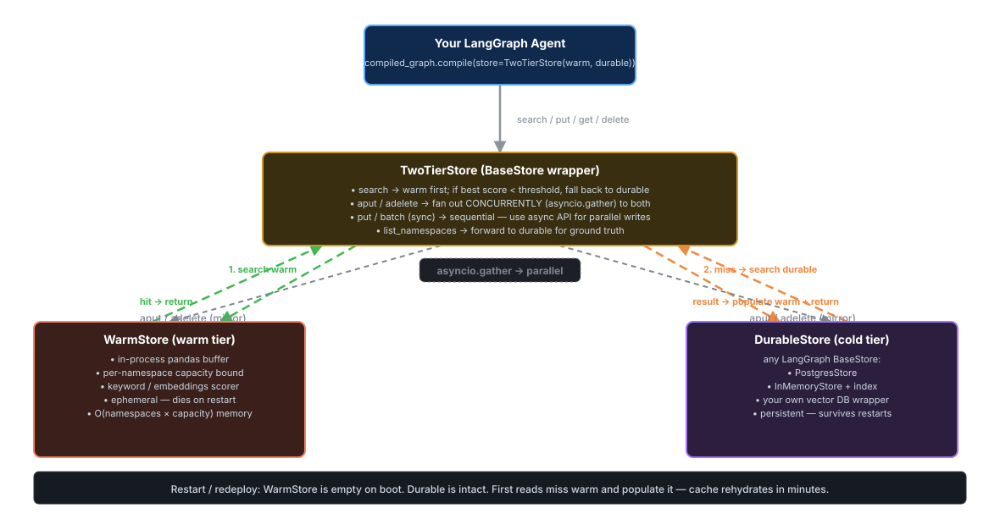

# Design: `TwoTierStore` for v0.3.0

> **Status:** design proposal. Diagram and contract first; implementation to follow once the shape is agreed.



## Problem

Today, anyone wanting "warm cache in front of a durable store" has to wire the orchestration themselves:

```python
hits = warm.search(("alice",), query=q, limit=5)
if hits and (hits[0].score or 0) >= 0.34:
    return hits                              # warm hit
return durable.search(("alice",), query=q, limit=5)  # fallback
```

And mirror writes by hand:

```python
warm.put(("alice",), key, value)
durable.put(("alice",), key, value)
```

That's the right *pattern* but it's boilerplate every user copies — and they need to do it identically every place they read or write memory. If they forget to mirror a write, the two stores drift. If they forget to fall back on a miss, the warm tier becomes a load-bearing cache that loses data on every redeploy.

## Proposal

A `TwoTierStore(warm, durable)` wrapper that **implements `BaseStore` itself** and dispatches transparently to both tiers. The user constructs it once and passes it to `StateGraph.compile(store=...)`; their agent code never knows there are two tiers.

```python
from langgraph.store.postgres import PostgresStore
from warm_memory.langgraph import WarmStore, TwoTierStore

warm = WarmStore(capacity=32)
durable = PostgresStore.from_conn_string(DB_URI)
store = TwoTierStore(warm=warm, durable=durable, warm_hit_threshold=0.34)

graph = StateGraph(...).compile(store=store)
# Done. Agent code uses `store` like any BaseStore — TwoTierStore handles the rest.
```

## Behavior (the contract)

The diagram captures the runtime flow. Operation-by-operation specification:

### `search(namespace_prefix, *, query=None, filter=None, limit=10, offset=0)`

The headline op — this is where the two-tier pattern saves cost.

1. Call `warm.search(...)` with the same args.
2. If the warm result is non-empty **and** the top score ≥ `warm_hit_threshold` (default 0.34), return it. **Durable is not queried.**
3. Otherwise, call `durable.search(...)` with the same args.
4. Populate warm with the durable results (`put` each, best-effort) so subsequent reads hit warm.
5. Return the durable results.

`limit`/`offset` are honored by whichever store is the source of truth for the response. We do **not** merge results from both tiers — that's a different design (union-search) that we explicitly aren't proposing here.

### `put(namespace, key, value, *, index=None, ttl=...)` / `aput(...)`

Write-through, with a sync/async split:

- **Async path (`aput`)**: warm and durable writes run **concurrently** via
  `asyncio.gather`. Total latency is `max(warm_put, durable_put)` ≈ `durable_put`,
  so the warm write is effectively free. This is the recommended path for
  production code.
- **Sync path (`put`)**: warm then durable, sequential. We considered using
  a `ThreadPoolExecutor` to parallelize the sync path too, but the savings
  (50–200 µs) don't justify the thread-pool lifecycle complexity. Users who
  care about write latency are usually already on async; the rest don't
  notice.

In both paths, **durable success is required** (errors propagate). Warm
failures are tolerated when `fail_on_warm_error=False` (the default): a
warm write that fails is logged but doesn't fail the operation, because
the durable tier already has the data and warm will rehydrate on the next
read miss.

The async error semantics:

```python
async def aput(self, namespace, key, value, **kwargs):
    warm_task = asyncio.create_task(self.warm.aput(namespace, key, value, **kwargs))
    try:
        await self.durable.aput(namespace, key, value, **kwargs)
    except Exception:
        warm_task.cancel()           # don't end up with cache-only data
        raise
    try:
        await warm_task
    except Exception as e:
        if self.fail_on_warm_error:
            raise
        log.warning("Warm write failed (durable already succeeded): %s", e)
```

Concurrent execution, but with the invariant that we only "succeed" once
durable has the data.

### `delete(namespace, key)`

Mirror — call both. Same error-propagation policy as `put`.

### `get(namespace, key, *, refresh_ttl=None)`

1. Call `warm.get(...)`.
2. If non-None, return it.
3. Otherwise call `durable.get(...)`; populate warm on the way back; return.

### `list_namespaces(...)`

Forward to **durable**. The warm tier only knows about namespaces it's seen recently; durable has the ground truth.

### `batch(ops)` / `abatch(ops)`

Iterate the ops, route each through the rules above. `abatch` inherits the
parallel-async behavior — every put/delete fans out concurrently to both
tiers. We don't try to be cute about batching writes across tiers (e.g.,
grouping all puts into a single transaction per store) — that's a
complexity multiplier with little win.

## Configuration knobs

```python
TwoTierStore(
    warm,                           # required
    durable,                        # required
    warm_hit_threshold: float = 0.34,
    populate_warm_on_miss: bool = True,
    write_through: bool = True,     # if False, writes only go to durable
    fail_on_warm_error: bool = False,  # warm errors don't fail the operation
)
```

`fail_on_warm_error=False` means warm is genuinely treated as a cache: if writing to warm raises (OOM, race, whatever), we log and continue to durable. The user's data still lands somewhere safe.

## Restart semantics

Annotated in the diagram footer. The short version:

- On boot, `WarmStore` is empty.
- `DurableStore` is intact (it's, well, durable).
- First reads on the new process miss warm → fall through to durable → populate warm.
- After a few minutes of normal traffic, warm is hot again.
- **Users perceive no data loss** because the durable tier carried them through.

## Not in scope for v0.3.0

- **Union search across tiers.** A future "search both, merge, dedupe" mode might be useful for full-recall scenarios, but it doubles cost on every query and isn't the current target use case.
- **Async write-through with eventual consistency.** Today: synchronous mirror. If write latency becomes a problem, we'd consider a fire-and-forget background queue, but that introduces visibility-after-write races we don't want to debug right now.
- **Per-namespace tier selection.** You couldn't say "this namespace bypasses warm." If anyone wants that we'll consider it post-v0.3.0.
- **TTL on warm.** Tracked separately. Once `WarmStore` supports TTL (`supports_ttl = True`), `TwoTierStore` forwards `ttl` through unchanged.

## Implementation sketch

```python
class TwoTierStore(BaseStore):
    __slots__ = ("warm", "durable", "warm_hit_threshold",
                 "populate_warm_on_miss", "write_through",
                 "fail_on_warm_error")

    def __init__(self, warm: BaseStore, durable: BaseStore, *,
                 warm_hit_threshold: float = 0.34,
                 populate_warm_on_miss: bool = True,
                 write_through: bool = True,
                 fail_on_warm_error: bool = False) -> None:
        self.warm = warm
        self.durable = durable
        ...

    def batch(self, ops):
        # Route each op individually through the appropriate _handle_* method.
        ...

    async def abatch(self, ops):
        return await asyncio.to_thread(self.batch, list(ops))
```

About 200 lines including docstrings and the `_handle_*` private methods. The dispatch logic is one `match`/`if-elif` block; the per-op logic is each a half-dozen lines.

## Test surface

22+ tests covering:

- Read paths: warm-hit short-circuits durable; warm-miss falls through to durable; durable result populates warm.
- Write paths: writes mirror to both; `write_through=False` skips warm; warm errors with `fail_on_warm_error=False` don't fail the op.
- Edge cases: `populate_warm_on_miss=False`; empty warm; threshold tuning.
- BaseStore conformance: `list_namespaces` forwards to durable, `batch` mixed-ops, async path.
- Integration: drop in `WarmStore + InMemoryStore` and confirm behavior matches the existing `warm-fallback` benchmark strategy.

## Migration & versioning

- Ship in **v0.3.0** (minor bump — additive, no breaking changes).
- Existing `WarmStore` and `EmbeddingsImportanceScorer` APIs are unchanged.
- The current LangGraph benchmark's `warm-fallback` strategy will be rewritten to use `TwoTierStore`, validating the wrapper against the same numbers we report today.

## Open questions

1. Should `TwoTierStore` itself implement TTL forwarding even before `WarmStore` does, by recording TTL hints separately? Leaning **no**; do it when WarmStore is ready.
2. Should `populate_warm_on_miss` fire on every miss or only when the durable result is "small enough"? Default to **every miss** for simplicity; revisit if pathological cases emerge.
3. Should we expose `TwoTierStore.stats()` for hit-rate observability? Leaning **yes** — useful for tuning `warm_hit_threshold` in production.
